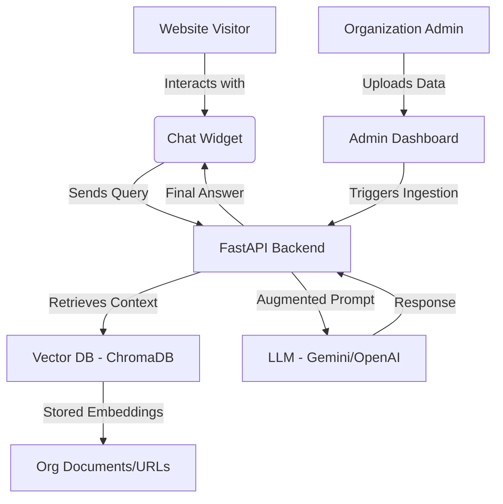

# Customizable AI Chatbot System (RAG)

A software system that allows organizations to create their own AI-powered chatbots by uploading documents or providing website URLs. These chatbots can then be embedded into any website using a simple script tag.

## User Review Required

> [!IMPORTANT]
> To begin implementation, you will need to provide:
> 1. **API Keys**: A **Google Gemini API Key** or **OpenAI API Key**.
> 2. **Sample Data**: One or two documents (PDF/TXT) or a website URL that represents the organization's knowledge base.
> 3. **Python Environment**: I will set up a virtual environment. Ensure you have Python 3.10+ installed.

## Setup Requirements
1. **API Key**: Required for the LLM (Gemini/OpenAI).
2. **Local Vector Storage**: We will use ChromaDB (no cloud account needed for the DB).
3. **Node.js/npm**: Required for building the frontend components.

## Proposed Architecture

## Proposed Changes

### [Backend] (Python/FastAPI)
Summary: Build a RAG-powered API to handle chat interactions and document ingestion.

#### [NEW] main.py
- FastAPI application setup.
- Endpoints for chatting, document uploading, and configuration.

#### [NEW] rag_engine.py
- LangChain implementation for PDF/URL loading.
- Text splitting and embedding generation.
- Vector database management with ChromaDB.

#### [NEW] requirements.txt
- `fastapi`, `uvicorn`, `langchain`, `chromadb`, `google-generativeai` (or `openai`), `pypdf`, `beautifulsoup4`.

---

### [Frontend - Admin Dashboard] (React + Vite + Tailwind)
Summary: A dashboard for organizations to manage their bot.

#### [NEW] Admin UI
- Document upload zone (Drag & Drop).
- Live preview of the chat widget.
- Configuration settings (Brand colors, Bot name, Initial greeting).
- Script tag generator (Copy-paste code for clients).

---

### [Frontend - Chat Widget] (React + Vite)
Summary: An embeddable widget that can be injected into any site.

#### [NEW] Widget Script
- Lightweight React component.
- Bundled into a single `widget.js` file.
- Uses Shadow DOM for style isolation.

## Build Sequence

### Phase 1: Environment & Project Inception
1.  **Project Structure**: Setup `backend/` and `frontend/` folders.
2.  **Backend Init**: Setup Python virtual environment and install dependencies.
3.  **Secrets Management**: Create a `.env` file for API keys.

### Phase 2: Core RAG Engine (Backend)
1.  **Document Loader**: Implement logic to read PDF/URL.
2.  **Vector Store**: Setup ChromaDB to save and retrieve embeddings.
3.  **Query Loop**: Create the API endpoint that takes a question and returns an AI answer based on the docs.

### Phase 3: Script-Tag Chat Widget (Frontend)
1.  **UI Components**: Build the chat bubble and message window in React.
2.  **Integration Logic**: Bundle the React app into a single `.js` file for easy embedding.

### Phase 4: Admin Dashboard (Frontend)
1.  **Management UI**: Create a page to upload docs and view bot performance.

## Verification Plan

### Automated Tests
- `pytest` for backend API endpoints.
- Integration tests for the RAG pipeline (Verify that uploading a document allows the bot to answer specific questions from it).

### Manual Verification
1.  **Ingestion Test**: Upload a specific PDF (e.g., a "Refund Policy") and ask the bot about refund terms.
2.  **Integration Test**: Embed the widget into a sample HTML file and verify it loads and communicates with the backend.
3.  **Multi-Org Test**: Verify that Organization A's bot doesn't answer using Organization B's data.
